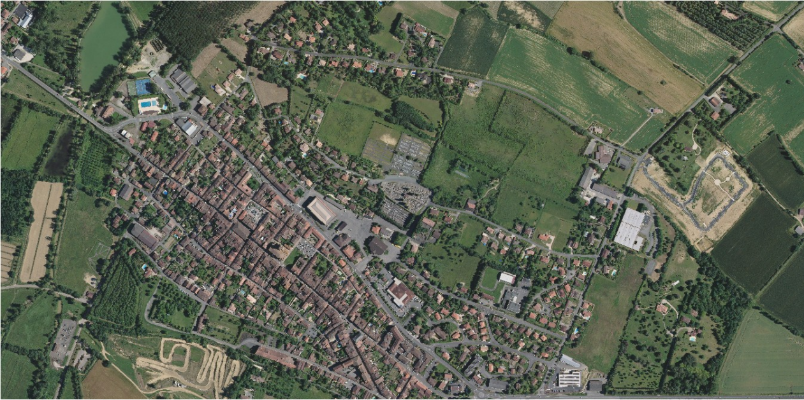
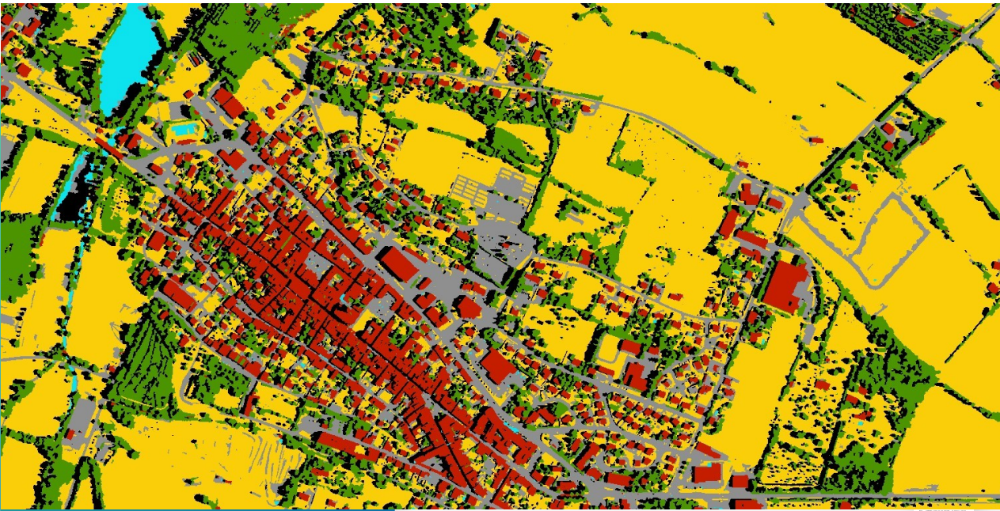

# Internship Context and Objective

The internship focuses on satellite image processing using artificial intelligence, with the main objective of achieving automatic contour detection to produce very high-resolution land-cover maps. This work falls within the field of image segmentation, aiming to identify and extract different objects such as buildings, fields, forests, and roads.
It contributes to an innovation effort aimed at improving automation in satellite image interpretation that can reduce manual processing time and enhance mapping accuracy in land-cover production.

# Overview
This project utilizes remote sensing data to classify land cover types within specific regions using machine learning techniques. By analyzing multispectral imagery and applying various processing techniques, the project aims to enhance our understanding of land use and vegetation health.
Machine learning offers significant advantages, but as this code demonstrates, combining it with effective data preprocessing and post-processing techniques can yield even better results.
The Achilles' heel of this project lies in the segmentation process, which introduces small artifacts that prevent the final result from being as smooth as it should be.

# Key Features
- Data Processing:The project processes multiple raster datasets, including RGB images, infrared imagery, and terrain models.
It computes the Normalized Difference Vegetation Index (NDVI) to assess vegetation health.

- Feature Extraction: The script extracts relevant features from the imagery using Laplace transformations, which highlight edges and transitions within the data.
Parallel processing is implemented to improve efficiency when handling large datasets.

- Machine Learning Classification:

The project employs a pre-trained Gradient Boosting model to classify different land cover types based on the extracted features.
The classification is performed on segmented regions defined by previously computed polygons.

- Output Generation:

The classified results are saved as GeoTIFF files, which can be easily integrated into GIS applications for further analysis.
The project can also generate polygon shapefiles for vector analysis of the classified regions.

# Data

Large range of data such as: RGB, IR, height elevation, etc.

Input (rgb):	
output (no shadow post process):	

MIT License

Copyright (c) 2025 Gainon Cyril
